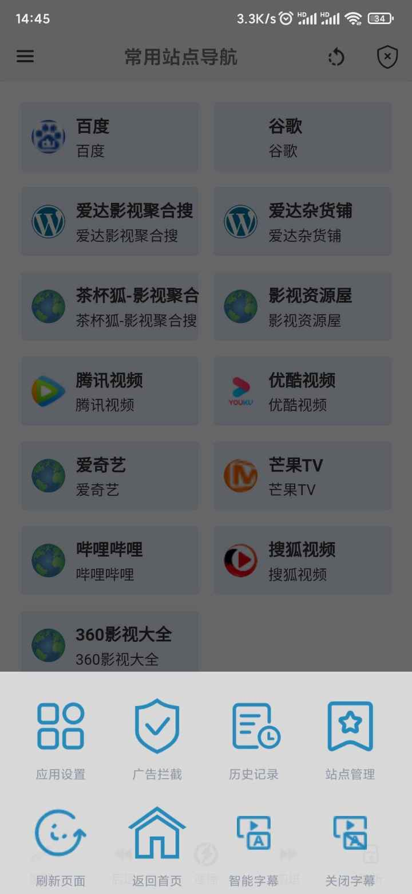
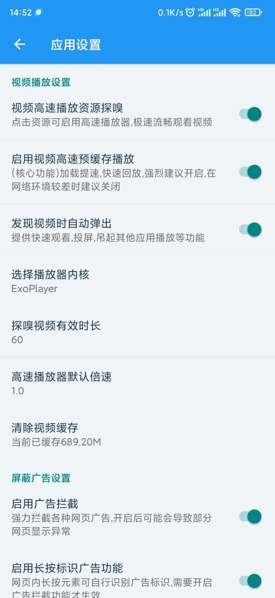
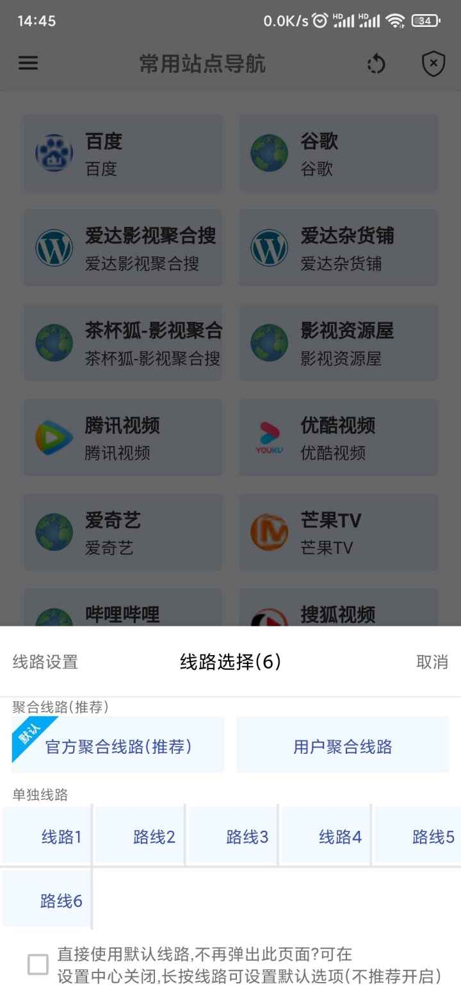
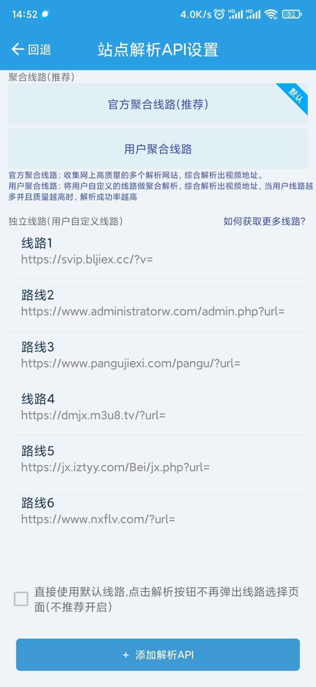
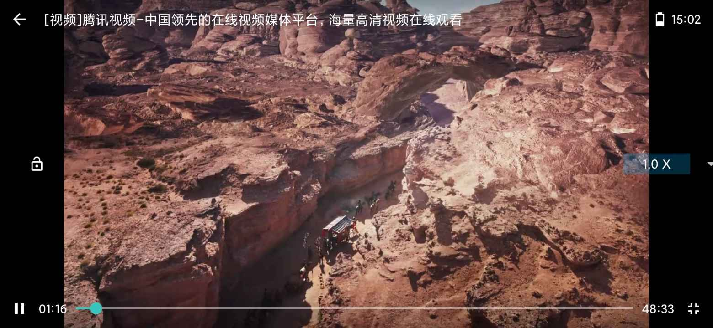

发现一款视频软件，以下是它的官网介绍，用起来很不错，给大家分享一下：
# 项目介绍
极速视频app，是一款聚合全网视频的浏览器软件，独有的强大的网站广告拦截利器，暴力去除网站上的各种小广告，打造一个干净整洁的浏览器应用。同时支持自动探嗅视频资源，并提供了解析接口管理功能，用户可自行收集并配置各种解析接口来解析各个视频网站的视频，并且集成了独家高速视频播放器，几乎可以解决一切的视频播放过程中的频繁加载卡顿等问题，使得即使是小众视频网站以及各种盗版视频网站的视频也能有流畅高速的观影体验。

# 功能介绍
## 全网视频聚合
软件首页收集了各大平台的视频网站地址，比如腾讯视频、优酷视频、爱奇艺、搜狗视频、Bilibili等，同时也收集了各个影视聚合搜索站点比如茶杯狐影视聚合搜索、爱达影视聚合搜索等，一键即可全网搜索你想看的视频。用户还可自行添加喜欢的站点到首页中，方便下次快速找到想看的内容，打造一个专属的视频聚合软件。
     
## 视频资源探嗅/网站解析
软件还支持自动探嗅视频资源，探嗅到资源后用户即可一键进行高速流畅播放，避免一些只能在小网站看到视频播放过程中频繁加载卡顿的问题，极大的提升了观影体验。
支持用户自定以接口对当前页面链接做解析，常见的就是用网上提供的的vip视频解析接口获取视频真实地址，实现免vip观看视频。
ps: 网络上有许多免费的VIP视频解析接口，大家自行百度即可获取，获取后用本软件的api解析配置功能配置好，就可以实现永久免费观看各大网站的视频。
  
## 广告拦截
广告拦截也是本软件强有力的功能，具备极其强大的去广告能力，目前为止还没发现有哪款浏览器去广告脚本的效果有比该软件更强大的，同时支持用户手动标记广告，标记后刷新页面即可去除该广告。本软件专业去除各种小广告，去除各种自动跳转广告，去除各种悬浮广告，拥有了本软件，可以拦截绝大部分视频网站的广告，不管是正版还是盗版网站，都可以变得很干净，直接看下面的去广告效果吧：
    
  
## 高速视频播放器
该软件集成了专用的高速视频播放器，该播放器旨在解决一切网络加载问题，某些情况下，即使是4倍速播放也不会有视频频繁加载导致播放卡顿的问题。一般来说，在一些小众视频网站尤其是一些盗版视频网站上会存在大量免费的视频（直接百度一下影视剧的名称就能搜出一大堆可以免费观看的网站），但是它们的播放效果特别卡顿，总是无故频繁发生加载卡顿，原本一个小时的视频可能看完需要两个小时左右，毫无体验感。本软件自带的高速播放器，专为解决此类问题而生，让你的网络满速加载视频，当探嗅到视频资源后，就请直接使用此高速播放器来观看吧，提升你的观影体验，你只需要这一款软件就够啦。
 
# 下载地址：
https://gitee.com/ytech/fast-video/releases/download/v2.0.2/app-release.apk
